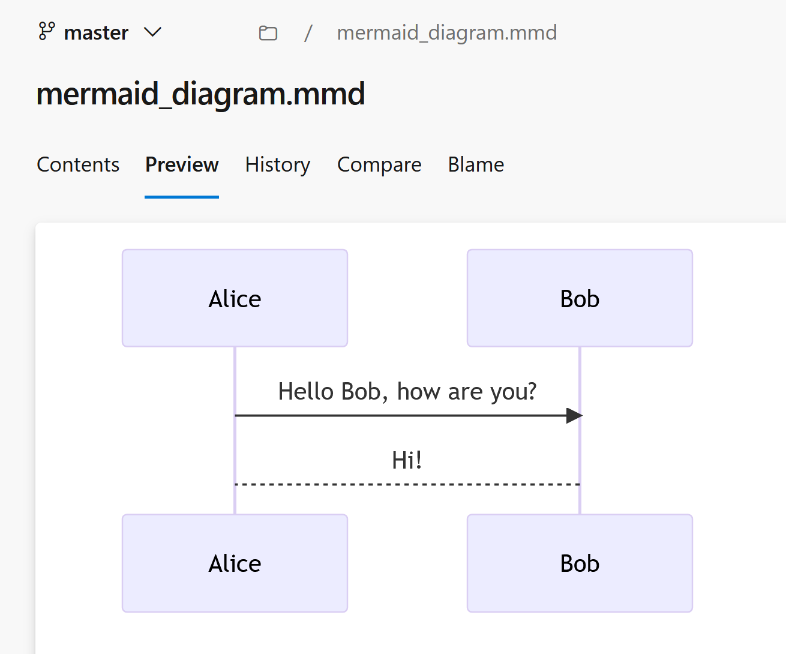

# Azure DevOps Extension: Mermaid Viewer

## Overview

This Azure DevOps Extension allows to render your .mmd files on your Azure DevOps Repos.

## Usage

Install this extension to your Azure DevOps Organization.

Go to Repos:
- in Files: if you select a Mermaid (`.mmd`) file you can find a new Preview tab
  
  

- in Pull Requests: if you select a Mermaid (`.mmd`) file you can find a Raw Content/Preview toggle button

  

## Run Locally

To Run Locally:
- install npm packages: `npm install`
- install tfx command line: `npm install -g tfx-cli`

 
To Debug Code:

- Create a new package for development purpose:
    `npx tfx-cli extension create --rev-version --overrides-file configs/dev.json`

- Deploy it on Azure DevOps Extension Marketplace: 
  https://marketplace.visualstudio.com/manage/publishers/danielecas

- And than run local code:
    `npx webpack-dev-server --mode development`

- Access to firefox to debug you extension

## Production Deployment

To create a new package for production deployment:
    `npx tfx-cli extension create --rev-version --env mode=production`

## For contributors

Contributions are welcome, Feel free to create a Pull Request or Contact me to give your suggestions 

  
<a href="https://www.flaticon.com/free-icons/mermaid" title="mermaid icons">Mermaid icons created by Freepik - Flaticon</a>