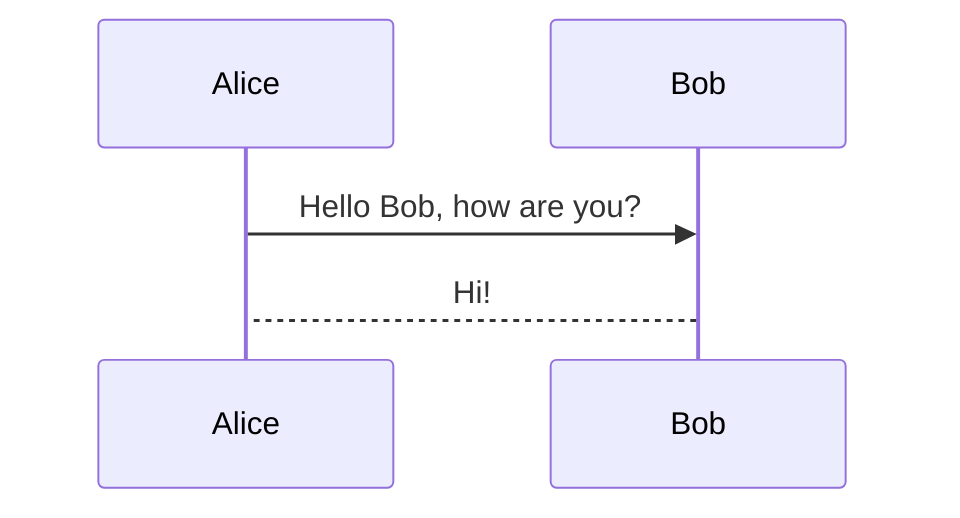

# Azure DevOps Extension: Mermaid Viewer

## Overview

This Azure DevOps Extension allows to render your .mmd files on your Azure DevOps Repos.

## Usage

Install this extension to your Azure DevOps Organization.

Go to Repos:
- in Files: if you select a Mermaid (`.mmd`) file you can find a new Preview tab
- in Pull Requests: if you select a Mermaid (`.mmd`) file you can find a Raw Content/Preview toggle button

## Run Locally

    npm install
    npm install -g tfx-cli
    tfx extension init

    webpack --mode development
    npx tfx-cli extension create  --rev-version

    webpack-dev-server --mode development

    (access to firefox to debug)

## For contributors

Contributions are welcome, Feel free to create a Pull Request or Contact me to give your suggestions 

<a href="https://www.flaticon.com/free-icons/mermaid" title="mermaid icons">Mermaid icons created by Freepik - Flaticon</a>