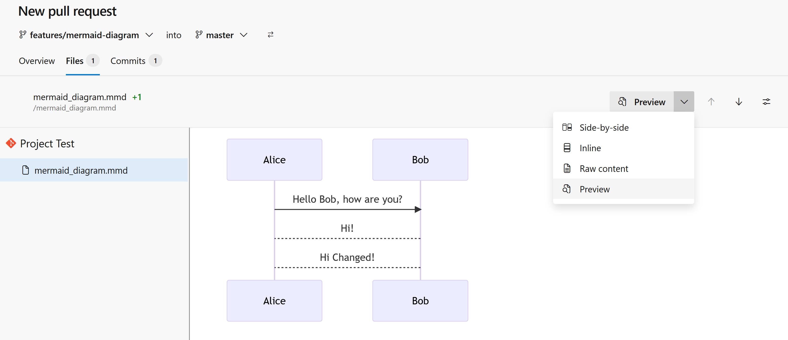

# Mermaid Viewer

Get a preview of your [mermaid](https://mermaid-js.github.io/mermaid/) diagrams in the Azure DevOps Repo.

This extension currently only works with `.mmd` files.

## Usage

Install this extension to your Azure DevOps Organization.

Go to Repos:
- in Files: if you select a Mermaid (`.mmd`) file you can find a new Preview tab
  
  

- in Pull Requests: if you select a Mermaid (`.mmd`) file you can find a Raw Content/Preview toggle button
  
  

The extension is based on Mermaid 10.2.4 version, so potentially breaking changes will not affect your stable features (unfortunately this is happened with others extensions) 

## Feedback

Please let me know how the extension can be improved! Contributions are also welcome!

- Create an issue in [GitHub](https://github.com/daniecas/azure-devops-mermaid-viewer/issues)

  
<a href="https://www.flaticon.com/free-icons/mermaid" title="mermaid icons">Mermaid icons created by Freepik - Flaticon</a>